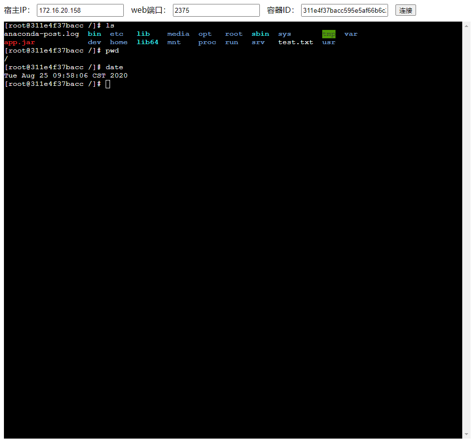

# Docker容器console连接工具

## 介绍：

基于Docker REST API，实现浏览器中远程连接Docker容器，类似于ssh连接的效果，预览图片如下：



## 使用方法

下载 [docker-console-1.0.jar](https://github.com/wangrui027/docker-console/releases/download/v1.0/docker-console-1.0.jar)，使用`java -jar`命令启动程序，程序正常启动后会自动打开默认浏览器进入web交互界面

启动命令如下：

```bash
## 使用默认端口号（8080）启动
java -jar docker-console-1.0.jar

## 使用自定义端口号（比如：8081）启动
java -jar docker-console-1.0.jar --server.port=8081
```

## 参考项目

[https://github.com/WillTong/java-docker-exec](https://github.com/WillTong/java-docker-exec)

